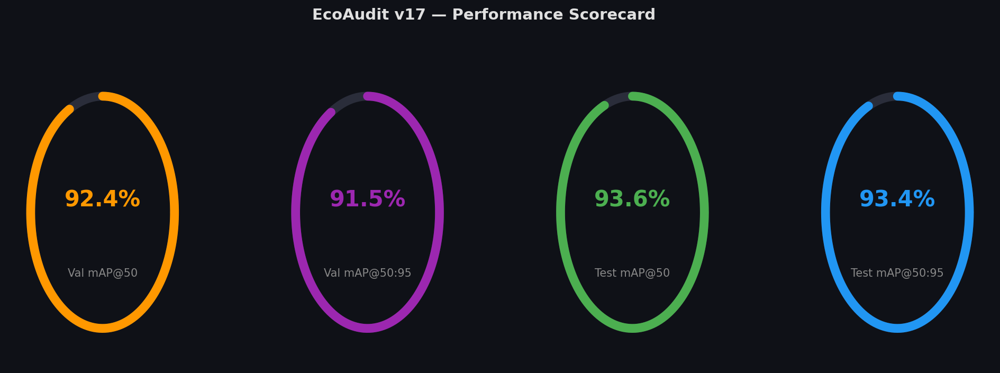
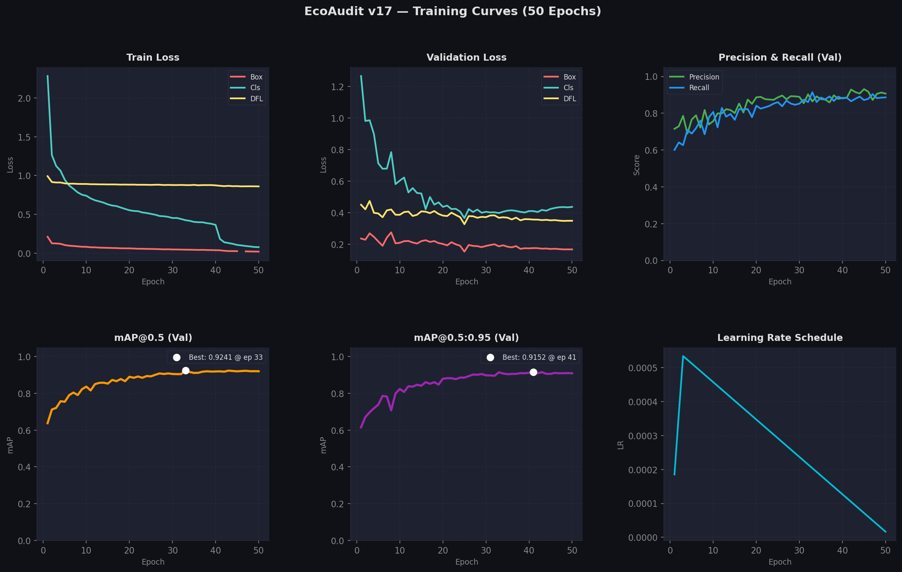
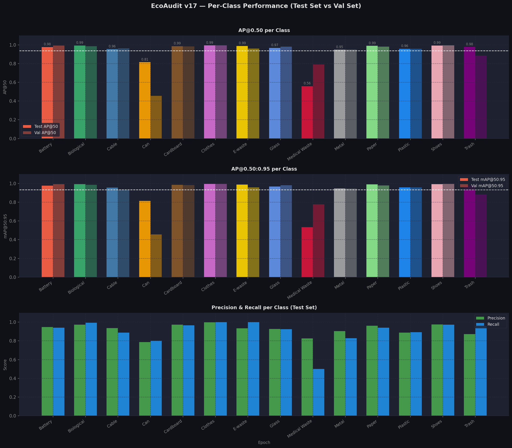
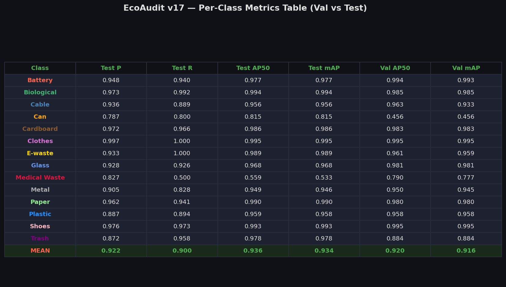
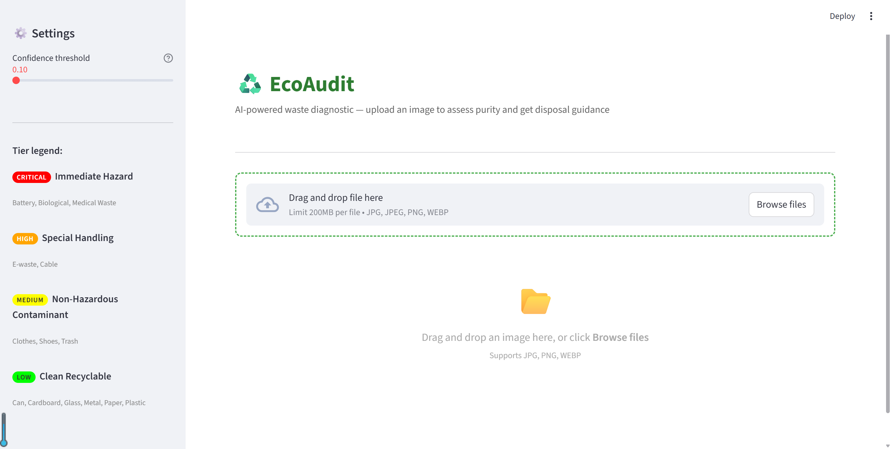

# ♻️ EcoAudit — AI Waste Diagnostic System

EcoAudit is an AI-powered waste detection and diagnostic system built on YOLOv11. It identifies 14 types of waste in images, assigns a **purity score**, a **contamination status**, and provides **disposal guidance** — helping facilities sort and handle waste safely and efficiently.

---

## Features

- **Object detection** — detects and localises waste items with bounding boxes
- **Tier-based diagnostic** — classifies every detected item into one of four hazard tiers
- **Purity score** (0–100 %) — computed from detected contaminants using a configurable penalty system
- **Status badge** — `CLEAN` or `CONTAMINATED`
- **Disposal guidance** — per-item instructions pulled from `diagnostic_config.json`
- **Streamlit frontend** — interactive UI with annotated image, score gauge, and detection cards
- **FastAPI backend** — REST API for programmatic access

---

## Project Structure

```
EcoAudit/
├── backend/
│   ├── main.py                  # FastAPI app (detect + diagnostic endpoints)
│   └── requirements.txt
├── frontend/
│   ├── app.py                   # Streamlit diagnostic UI
│   └── diagnostic_config.json  # Tier definitions, penalties, disposal guidance
└── training/
    ├── prepare_dataset.py       # Dataset preparation & train/val/test split
    ├── train.py                 # Model training script
    ├── test.py                  # Test-set evaluation script
    ├── analyze.py               # Performance analysis & chart generation
    └── dataset/
        ├── data.yaml
        └── images/
            ├── train/           # 10 863 images
            ├── val/             #  2 032 images
            └── test/            #    692 images
```

---

## Dataset

Dataset is downloaded from:

- [Kaggle](https://www.kaggle.com/datasets/sumn2u/garbage-classification-v2)
- [Mendeley Data](https://data.mendeley.com/datasets/mr67c82zw7/2)

| Split | Images |
|-------|-------:|
| Train | 10 863 |
| Val   |  2 032 |
| Test  |    692 |
| **Total** | **13 587** |

**Split ratio** — 80 % train / 15 % val / 5 % test (stratified per class, `seed=42`).

### 14 Waste Classes

| # | Class | # | Class |
|---|-------|---|-------|
| 0 | Battery | 7 | Glass |
| 1 | Biological | 8 | Medical Waste |
| 2 | Cable | 9 | Metal |
| 3 | Can | 10 | Paper |
| 4 | Cardboard | 11 | Plastic |
| 5 | Clothes | 12 | Shoes |
| 6 | E-waste | 13 | Trash |

Dataset preparation assigns a full-image bounding box label (`cx=0.5, cy=0.5, w=1.0, h=1.0`) per image, then splits by class into the three sets.

---

## Model Training

**Model:** YOLOv11n (nano) — pretrained on COCO, fine-tuned on EcoAudit dataset.

| Hyperparameter | Value |
|----------------|-------|
| Epochs | 50 |
| Image size | 640 px |
| Batch size | 16 |
| Optimizer | Auto (SGD) |
| Initial LR | 0.01 |
| LR final factor | 0.01 |
| Momentum | 0.937 |
| Weight decay | 0.0005 |
| Warmup epochs | 3 |
| Device | GPU (CUDA 0) |
| AMP | Enabled |
| Augmentation | Mosaic, RandAugment, HSV, flip, scale, erasing |
| Close mosaic | Last 10 epochs |

**Run:** `training/runs/detect/runs/ecoaudit_v17/`
**Best weights:** `weights/best.pt`

To retrain:
```bash
cd training
python train.py
```

To evaluate on the test set:
```bash
cd training
python test.py
```

To generate performance charts and a summary report:
```bash
cd training
python analyze.py
```

---

## Model Performance Analysis

Charts generated by `training/analyze.py` from the completed training and test-set evaluation.

### Scorecard



| Metric | Val Set | Test Set |
|--------|--------:|---------:|
| mAP@0.50 | **92.4 %** | **93.6 %** |
| mAP@0.50:95 | **91.5 %** | **93.4 %** |
| Mean Precision | — | 92.2 % |
| Mean Recall | — | 90.0 % |

Best val mAP@0.50 was reached at **epoch 33** (0.9241). Best val mAP@0.50:95 was reached at **epoch 41** (0.9152). Training ran for the full 50 epochs with `patience=100`. Test-set scores marginally exceed validation scores, confirming no overfitting.

---

### Training Curves



Key observations:
- **Train losses** (box, cls, DFL) decreased consistently across all 50 epochs.
- **Classification loss** dropped sharply after epoch 40 when mosaic augmentation was closed (`close_mosaic=10`), allowing the model to fine-tune on clean images.
- **Validation losses** converged and plateaued without divergence — no signs of overfitting.
- **Precision and Recall** both exceeded 0.85 by epoch 15 and stabilised above 0.90 by epoch 30.
- **LR schedule** warmed up over 3 epochs then linearly decayed to near zero by epoch 50.

---

### Per-Class Performance





| Class | Test P | Test R | Test AP50 | Test mAP | Val AP50 | Val mAP |
|-------|-------:|-------:|----------:|---------:|---------:|--------:|
| Battery | 0.948 | 0.940 | 0.977 | 0.977 | 0.994 | 0.993 |
| Biological | 0.973 | 0.992 | 0.994 | 0.994 | 0.985 | 0.985 |
| Cable | 0.936 | 0.889 | 0.956 | 0.956 | 0.963 | 0.933 |
| Can | 0.787 | 0.800 | 0.815 | 0.815 | 0.456 | 0.456 |
| Cardboard | 0.972 | 0.966 | 0.986 | 0.986 | 0.983 | 0.983 |
| Clothes | 0.997 | 1.000 | 0.995 | 0.995 | 0.995 | 0.995 |
| E-waste | 0.933 | 1.000 | 0.989 | 0.989 | 0.961 | 0.959 |
| Glass | 0.928 | 0.926 | 0.968 | 0.968 | 0.981 | 0.981 |
| Medical Waste | 0.827 | 0.500 | 0.559 | 0.533 | 0.790 | 0.777 |
| Metal | 0.905 | 0.828 | 0.949 | 0.946 | 0.950 | 0.945 |
| Paper | 0.962 | 0.941 | 0.990 | 0.990 | 0.980 | 0.980 |
| Plastic | 0.887 | 0.894 | 0.959 | 0.958 | 0.958 | 0.958 |
| Shoes | 0.976 | 0.973 | 0.993 | 0.993 | 0.995 | 0.995 |
| Trash | 0.872 | 0.958 | 0.978 | 0.978 | 0.884 | 0.884 |
| **MEAN** | **0.922** | **0.900** | **0.936** | **0.934** | **0.920** | **0.916** |

**Top performers** — Clothes (0.995), Biological (0.994), Shoes (0.993), Paper (0.990), E-waste (0.989).

**Weakest classes:**
- **Medical Waste** — Test AP50: 0.559, Recall: 0.500. The model misses roughly half of all medical waste items, likely due to high visual diversity (syringes, bandages, masks). This is the most critical gap given the class's Tier 1 hazard status.
- **Can** — Test AP50: 0.815. The test score is reasonable but val AP50 is unusually low (0.456), suggesting high variance in the validation split for this class.

---

## Diagnostic System

The diagnostic logic is fully defined in `frontend/diagnostic_config.json` and shared by both the frontend and backend.

### Hazard Tiers

| Tier | Name | Severity | Classes | Penalty |
|------|------|----------|---------|---------|
| Tier 1 | Immediate Hazard | Critical 🔴 | Battery, Biological, Medical Waste | Instant zero |
| Tier 2 | Special Handling | High 🟠 | E-waste, Cable | −25 per item |
| Tier 3 | Non-Hazardous Contaminant | Medium 🟡 | Clothes, Shoes, Trash | −15 per item |
| Tier 4 | Clean Recyclable | Low 🟢 | Can, Cardboard, Glass, Metal, Paper, Plastic | 0 |

### Purity Score Formula

```
Score = 100

If any Tier 1 item detected → Score = 0 (immediate)
Otherwise → Score = 100 − Σ(penalty_per_unit for each detected item)
Score = max(Score, 0)

Status = "CLEAN" if Score == 100 else "CONTAMINATED"
```

---

## API — FastAPI Backend

Start the server:
```bash
cd backend
pip install -r requirements.txt
uvicorn main:app --reload
```

### Endpoints

| Method | Path | Description |
|--------|------|-------------|
| `GET` | `/` | Health check |
| `POST` | `/detect` | Detection JSON (class, confidence, bbox) |
| `POST` | `/detect/image` | Annotated image (class-coloured boxes) |
| `POST` | `/diagnostic` | Diagnostic JSON (purity score, status, guidance) |
| `POST` | `/diagnostic/image` | Annotated image (tier-coloured boxes) |

**`POST /diagnostic` — example response:**
```json
{
  "filename": "bin.jpg",
  "purity_score": 75,
  "status": "CONTAMINATED",
  "count": 2,
  "detections": [
    {
      "class_name": "Trash",
      "confidence": 0.87,
      "tier": "tier_3",
      "tier_name": "Non-Hazardous Contaminant",
      "severity": "Medium",
      "tier_color": "#FFFF00",
      "guidance": "Non-recyclable. Dispose of in the standard landfill bin.",
      "bbox": { "x1": 120.0, "y1": 85.0, "x2": 340.0, "y2": 290.0 }
    }
  ]
}
```

All endpoints accept `conf` (float, default `0.5`) as a query parameter to control the detection confidence threshold.

---

## Frontend — Streamlit App

```bash
cd frontend
pip install streamlit ultralytics pillow
streamlit run app.py
```

The UI provides:
- **Image upload** (JPG, PNG, WEBP)
- **Annotated image tab** — bounding boxes coloured by tier (red / orange / yellow / green)
- **Original image tab**
- **Purity score gauge** — colour-coded number + progress bar
- **CLEAN / CONTAMINATED status badge**
- **Detection cards** — class name, severity, confidence, disposal guidance
- **Handling instructions** — global tier-level action for each tier found
- **Download** — annotated diagnostic image
- **Sidebar** — confidence threshold slider + tier legend



---

## Dependencies

**Backend (`backend/requirements.txt`)**
```
fastapi
uvicorn[standard]
pillow
ultralytics
```

**Frontend**
```
streamlit
ultralytics
pillow
```

**Training / Analysis**
```
ultralytics
pandas
numpy
matplotlib
pyyaml
```
